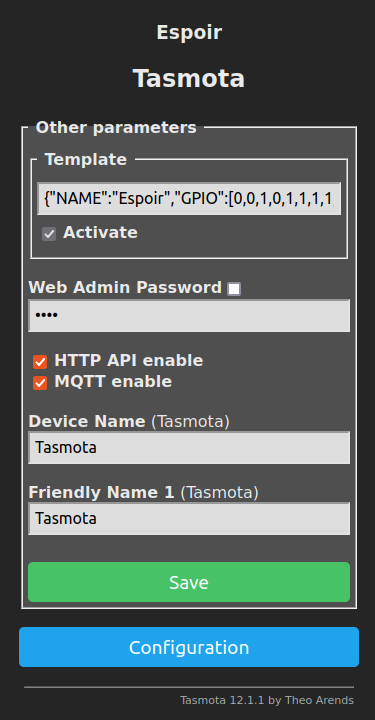

# Firmware

Espoir is compatible with _many_ software tools to accelerate development. This section outlines how to quickly get started with the most popular (and officially supported) ones.

::: warning
Some modules of Espoir Rev 1.1 have been reworked, with a red wire in place of the Ethernet PHY crystal. These modules, as well as Espoir Rev 1.2 and above, now operate in the `CONFIG_ETH_RMII_CLK_OUTPUT_GPIO0`  (also known as `ETH_CLOCK_GPIO0_OUT`) mode. Make sure you adapt the code examples below if your Espoir board corresponds to this description.
:::

## [ESP-IDF](https://docs.espressif.com/projects/esp-idf/en/stable/esp32/get-started/index.html)

ESP-IDF is Espressif's IoT Development Framework, the most barebones development framework for ESP32. It is the basic building block for all other frameworks, and features drivers for all peripherals. To get started, simply follow the [Getting Started guide](https://docs.espressif.com/projects/esp-idf/en/stable/esp32/get-started/index.html).

At the time of writing, most frameworks are based on ESP-IDF 4.4, and ESP-IDF 5.0 is currently in beta release.

## [Arduino-ESP32](https://docs.espressif.com/projects/arduino-esp32/en/latest/getting_started.html)

To program Espoir with Arduino, simply follow the [official Arduino-ESP32 documentation](https://docs.espressif.com/projects/arduino-esp32/en/latest/getting_started.html). Select `Connaxio's Espoir` as your board, either in ArduinoIDE or PlatformIO.

If you wish to quickly test Espoir, you can run the `ETH_LAN8720` example with the following modified line:

```cpp
ETH.begin(0, -1, 32, 33, ETH_PHY_KSZ8081, ETH_CLOCK_GPIO0_IN);
```

## [MicroPython](https://micropython.org/)

MicroPython for Espoir is currently supported by Connaxio ([source](https://github.com/Connaxio/micropython/tree/feature/espoir)).

You can download the compiled binary file here: [micropython-espoir-v1.19.1.bin](https://docs.connaxio.com/micropython/micropython-espoir-v1.19.1.bin).

Download and extract the latest esptool release from the [official repository on GitHub](https://github.com/espressif/esptool/releases) for the next steps.

If flashing for the first time, you should first erase Espoir's flash:

```bash
esptool.py --chip esp32 --port <PORT> erase_flash
```

then upload the binary file, by replacing `<PORT>` with the actual serial port, typically `/dev/ttyUSBx` for Linux and `COMx` for Windows:

```bash
esptool.py -p <PORT> -b 460800 --before default_reset --after hard_reset --chip esp32  write_flash --flash_mode dio --flash_size detect --flash_freq 80m 0x1000 micropython-espoir-v1.19.1.bin
```

You are now ready to open a serial port to Espoir with a baudrate of `115200`. After pressing `ENTER` once, you can type the following commands to establish your first LAN connection:

```python
from machine import Pin
import network

lan=network.LAN(mdc=Pin(32),mdio=Pin(33),power=None,phy_type=network.PHY_KSZ8081,phy_addr=0)

lan.active(1)
lan.ifconfig() # Prints DHCP configuration.
```

## [Tasmota](https://tasmota.github.io/docs/)
The following instructions are up to date as of Tasmota 12.4.0.

The preferred, and simplest way to install Tasmota is to download [ESP-Flasher](https://github.com/Jason2866/ESP_Flasher/releases/latest) for your platform, and to download [the latest binary file from GitHub](https://github.com/arendst/Tasmota/releases/latest) according to your preferences. Then, follow the following steps:

1. Run ESP-Flasher, select Espoir's port, the binary file you just downloaded, and click "Flash ESP"

2. Connect to the ESP32's Wi-Fi hotspot with your computer or phone, and configure it to connect to your local network. Its new IP address will be displayed.

3. Connect to the ESP32's new IP address.

4. To enable Ethernet, go to `Consoles` -> `Console`, and run the following commands:

```
Ethernet 1
EthAddress 0
EthType 6
EthClockMode 0
```

5. Configure Espoir's pins. In your device's new Tasmota Web Interface, go to `Configuration` -> `Configure Other`, and in the `Template` box, enter the following configuration line, activate it, and save:
   
   ```
   {"NAME":"Espoir","GPIO":[0,0,1,0,1,1,1,1,1,1,1,1,0,0,1,0,0,0,0,1,0,0,0,0,0,0,0,0,5568,5600,1,7968,1,1,1,1],"FLAG":0,"BASE":1}
   ```
   
   <center>
   
   
   
   </center>

6. (Optional) Deactivate Wi-Fi on boot after an Ethernet connection is established. Follow [the official instructions](https://tasmota.github.io/docs/Berry-Cookbook/#ethernet-network-flipper)

**That's it**, you are now ready to configure your application-specific settings through the other menus of the web interface.
