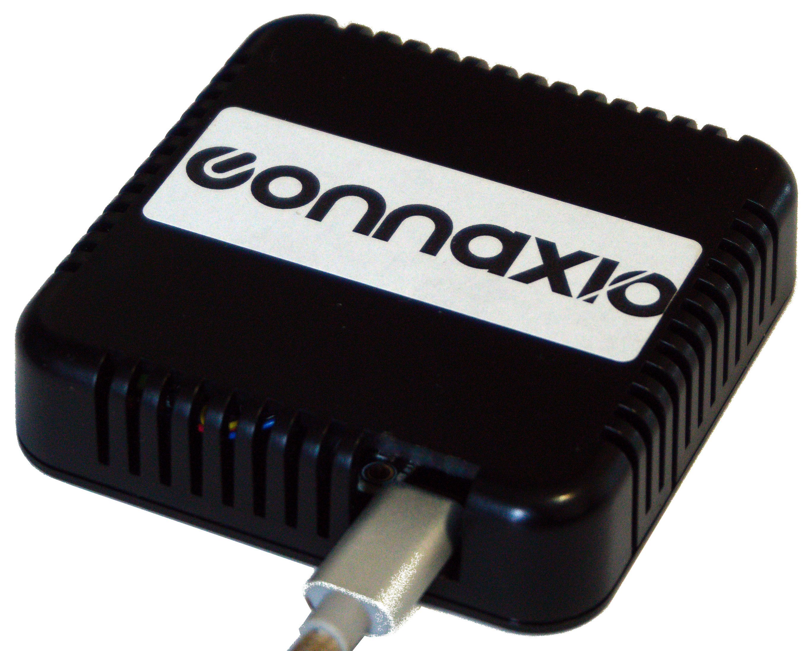
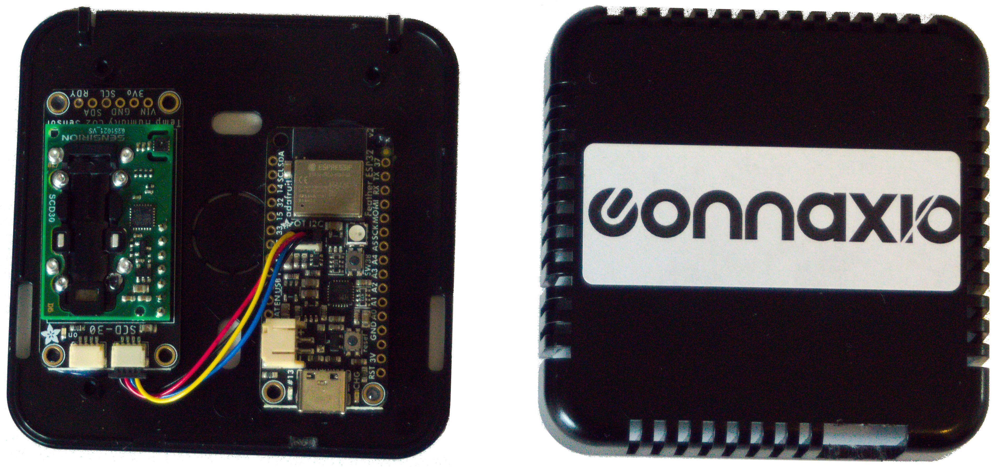
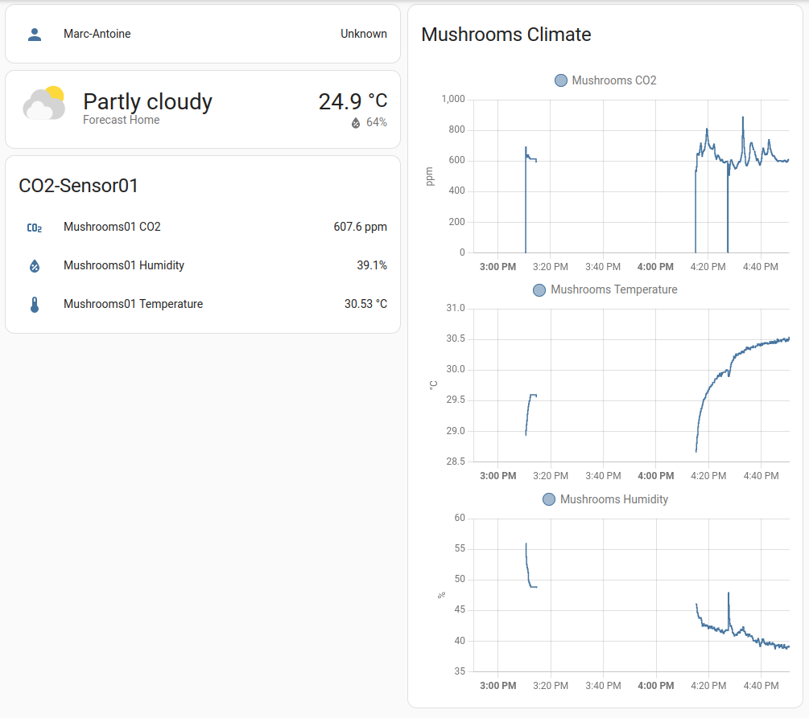

# CO<sub>2</sub> sensor for Home Assistant


A client contacted me to automate his mushroom production, for which he requires:

- Temperature control
- Humidity control
- CO<sub>2</sub> control
- Remote monitoring and parameters adjustment

Since he didn't have a central automation system yet, I suggested and designed around [Home Assistant](https://www.home-assistant.io/), which offers tons of functionalities and works from the local network on an old laptop or a Raspberry Pi. It's also easy to add more devices to it, and it integrates well with popular ecosystems like Amazon Alexa and Google Nest.

## Hardware


We went for the simplest, fastest, easiest design, which includes:
- Adafruit's [Feather ESP32 V2 development board](https://learn.adafruit.com/adafruit-esp32-feather-v2)
- Adafruit's [SCD-30 CO<sub>2</sub>, temperature and humidity sensor](https://learn.adafruit.com/adafruit-scd30)
- A small, ventilated enclosure for the sensor
- A JST SH 4-pin cable (also called STEMMA QT or Qwiic, or whatever)
- A power strip with smart plugs (in this case, TP-Link's Kasa HS103 or KP303 were good choices for our goal)
- A [Raspberry Pi 4](https://www.raspberrypi.com/) to host the Home Assistant instance

When it came to sensor choice, given the small differences in price, we went for the most precise and simplest, all-in-one solution. Other contenders would have been the SCD-40, SCD-41, and MH-Z19 sensors.

With the hardware choice settled, I placed the order and parts arrived 2 days later.

## Software
I went with [ESPHome](https://esphome.io/) to run the sensor with Home Assistant. [Tasmota](https://tasmota.github.io) is another great firmware option, though while it offers more settings and flexibility, I find it more complex and less user-friendly, especially for this kind of simple project.

The first time programming the Feather must be done via USB, and the easiest way is probably to [use the Home Assistant ESPHome add-on](https://esphome.io/guides/getting_started_hassio.html). However, I've never had any luck with web serial, so I went with the [command-line](https://esphome.io/guides/getting_started_command_line) setup method instead.

In any case, after running the setup wizard and before uploading the configuration file to the Feather, I modified `co2-sensor.yaml` like so:

``` yaml
esphome:
  name: co2-sensor01
  platformio_options:
    board_build.f_cpu: 80000000L    # Slow down ESP32 to reduce power.

esp32:
  board: adafruit_feather_esp32_v2
  framework:
    type: arduino

# Enable logging
logger:

# Enable Home Assistant API
api:
  password: "api_password"

ota:
  password: "ota_password"

wifi:
  ssid: "Super-Duper-Wi-Fi"
  password: "SupErS3cretP@$$w0rd"

  # Enable fallback hotspot (captive portal) in case wifi connection fails
  ap:
    ssid: "Co2-Sensor01 Fallback Hotspot"
    password: "SupErS3cretP@$$w0rd2"

captive_portal:

# New section

# Optional: Enable Deep Sleep for spaced out measurements
# deep_sleep:
#   run_duration: 10s
#   sleep_duration: 10min

i2c:
  sda: 22
  scl: 20
  scan: true
  id: i2c_bus_1

sensor:
  # https://esphome.io/components/sensor/scd30.html?highlight=scd30
  - platform: scd30
    co2:
      name: "Mushrooms01 CO2"
      accuracy_decimals: 1
    temperature:
      name: "Mushrooms01 Temperature"
      accuracy_decimals: 2
      filters:
        offset: -0.2   # To be calibrated
    humidity:
      name: "Mushrooms01 Humidity"
      accuracy_decimals: 1
    address: 0x61
    update_interval: 10s
```

If using the command-line, the configuration file can be added to the ESPHome Add-On by creating a new device, and then editing the configuration file there with what was uploaded to the Feather. The add-on will then detect the sensor as if it was setup via Home Assistant.

Finally, I added the [Node-RED add-on](https://community.home-assistant.io/t/home-assistant-community-add-on-node-red/55023) to create my automation rules, the [TP-Link Kasa Smart](https://www.home-assistant.io/integrations/tplink/) integration to control my smart plugs, and the [ESPHome](https://www.home-assistant.io/integrations/esphome/) integration (not the add-on) to access the new CO<sub>2</sub>, temperature and humidity sensor readings. A simple History graph card on the dashboard then lets me inspect the sensor readings.



A steady airflow around the sensor is required to get accurate readings. Contact me at hello@connaxio.com for help with calibration, control loop, and installation tips.
