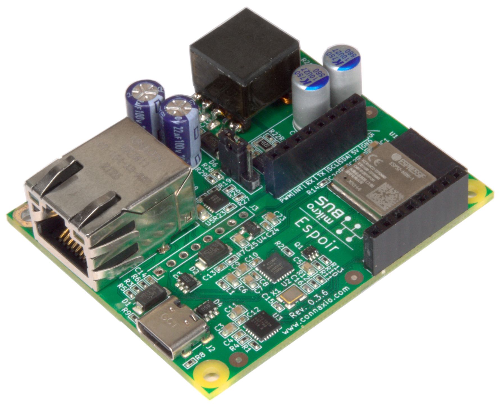
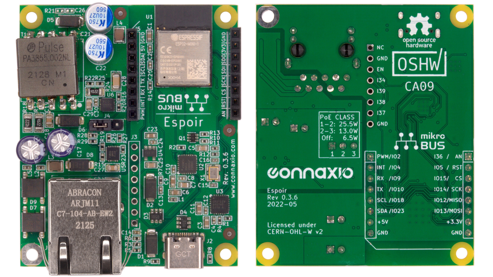
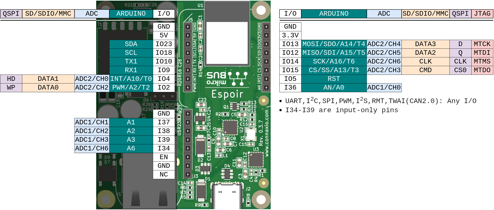
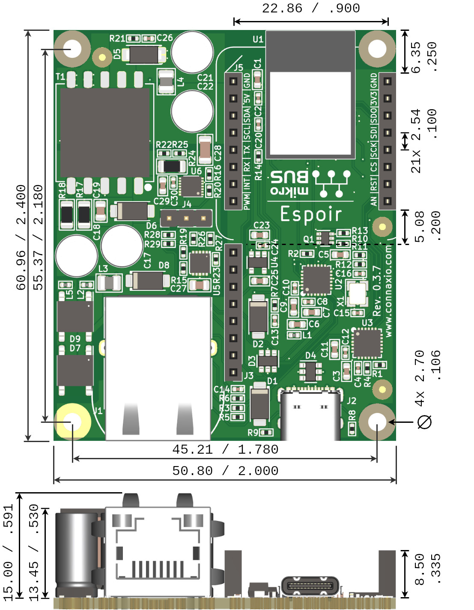

# Espoir

## Overview
Espoir is a Power over Ethernet+ (PoE+ 802.3af/at) mikroBUSTM mainboard based on the ESP32-MINI-1 microcontroller. 

It reduces risk, cost, and time to market by taking care of the often more challenging aspects of designing power supply and high-speed circuits of a microcontroller board. Developers can focus on their application and get to testing and deployment quickly.

Espoir's mikroBUSTM socket provides incredible ease of use, with over 1,300 mikroBUSTM add-on boards available right away, including Connaxio's mikroShield and makroShield (coming soonTM) families.

|Example applications   |Compatible IDEs    |Compatible frameworks          |
|:----------------------|:------------------|:------------------------------|
|Smart farming          |Eclipse IDE        |Espressif's ESP-IDF            |
|Smart lighting         |PlatformIO IDE     |Arduino                        |
|Access control         |Arduino IDE        |MicroPython                    |
|Assembly line tracking |PyCharm            |ESPHome (soonTM)    |
|Home automation        |(and many more!)   |Tasmota (soonTM)    |

## Features & Specifications

- ESP32-MINI-1 Processor
    - Single or dual core 240 MHz
    - 520 KB SRAM
    - 4 MB flash
- Power
    - Input: PoE+ 37 V - 57 V through the Ethernet connector, with 2,250 V isolation
    - Input: 5 V through the USB-C connector (4.6 V available through a protection diode)
    - Output: 5 V at 3 A (15 W) from PoE
    - Output: 3.3 V at 0.7 A (2.3 W) (Linear, derived from the 5 V power rail)
    - Jumper-selectable PoE Class 2, 3, and 4
    - Pi-filtered PoE input and output
    - Overload and thermal protections 
- Connectivity
    - Wifi 2.4 GHz 802.11b/g/n \& integrated antenna
    - Bluetooth 4.2 BLE
    - Ethernet 10/100-BaseT (80+ mbps throughput)
    - USB 2.0 via USB-C connector (tested at 2 MBaud)
    - Full mikroBUSTM socket with two grounds, 5 V, 3.3 V and 12 IOs
    - Extension header with two grounds, four additional input only pins, and the ESP32 reset signal (unsoldered socket header included)
- Mechanical
    - Weight: 31 g
    - Size: 50.8 x 61.0 mm2
    - PCB thickness: 1.6 mm
    - Four copper layers provide augmented thermal dissipation and electromagnetic compatibility
    - Mounting holes: 4x M2.5 / 4-40. The bottom-left hole is plated and connected to local ground.
- Operating temperature range: -40 oC to +85 oC

## Top & Bottom Views

## Pinout

**Figure: Espoir's headers' pins**

**Table: Espoir's headers' pins mapping**
| Espoir's ESP32-MINI-1 | mikroBUSTM socket  | Arduino               |
|:----------------------|:------------------------------|:----------------------|
| IO2                   | PWM                           | A2 / T2 / PWM         |
| IO4                   | INT                           | A10 / T0 / INT        |
| IO5                   | RST                           | RST                   |
| IO9                   | RX                            | RX1                   |
| IO10                  | TX                            | TX1                   |
| IO12                  | MISO / SDI                    | A15 / T5 / MISO / SDI |
| IO13                  | MOSI / SDO                    | A14 / T4 / MOSI / SDO |
| IO14                  | SCK                           | A16 / T6 / SCK        |
| IO15                  | CS                            | A13 / T3 / CS / SS    |
| IO18                  | SCL                           | SCL                   |
| IO23                  | SDA                           | SDA                   |
| I34                   | -                             | A6                    |
| I36                   | AN                            | A0 / AN               |
| I37                   | -                             | A1                    |
| I38                   | -                             | A2                    |
| I39                   | -                             | A3                    |

**Table: Espoir's "internal" pins mapping**
| Espoir's ESP32-MINI-1 | Signal        |
|:----------------------|:--------------|
| IO1                   | USB UART TX   |
| IO3                   | USB UART RX   |
| IO0                   | EMAC TX CLK   |
| IO19                  | EMAC TXD0     |
| IO21                  | EMAC TXD1     |
| IO22                  | EMAC TX EN    |
| IO25                  | EMAC RXD0     |
| IO26                  | EMAC RXD1     |
| IO27                  | EMAC RX DV    |
| IO32                  | EMAC MDC      |
| IO33                  | EMAC MDIO     |
| I35                   | ETH PHY PME N |

## Dimensions
The main dimensions of Espoir are presented here. Complete 3D models can be found in Espoir's repository on Github.

The connector shields and the bottom-left mounting hole are connected to the local ground. It is therefore safe (and recommended) to connect them to a metal case.

Care must be taken to leave enough spacing under the PCB to avoid accidental contact of the through-hole pins with the case. A 1 mm gap should be observed between the pins and and any conductive material to maintain proper isolation. 3 mm between the bottom of the PCB and the mounting surface is typically a good starting point.

## Safety Considerations
### Electrocution Hazard
The area around the main transformer and Ethernet jack contains parts that operate at a typical voltage of 57 V, with peak voltages of up to 150 V. In some situations, these voltages may cause injury or death. Avoid contact with the SMD components (top) or solder joints (bottom) during operation.

### Burn Hazard
Under constant heavy load, the area and parts around the main transformer may reach over 100 oC and cause severe burns. Avoid contact with both the top and bottom of the PCB in that region when high load conditions are expected.

### Safe Handling
An IP20 enclosure with proper ventilation is recommended to avoid accicental contact and overheating. Espoir's repository offers a 3D printable snap-on backplate that provides protection from accidental contact and good ventilation.

## Certifications

|Directive  |Applicable standards   |
|:----------|:----------------------|

## Additional Resources
- [Espoir's source on GitHub](https://github.com/Connaxio/espoir)
- [Espoir's launch page at Crowd Supply](https://www.crowdsupply.com/connaxio/espoir)
- [Espoir's OSHWA certification page](https://certification.oshwa.org/ca000009.html)
- [Datasheet: ESP32-MINI-1](https://www.espressif.com/sites/default/files/documentation/esp32-mini-1_datasheet_en.pdf)
- [Datasheet: ESP32-U4WDH](https://www.espressif.com/sites/default/files/documentation/esp32_datasheet_en.pdf)

