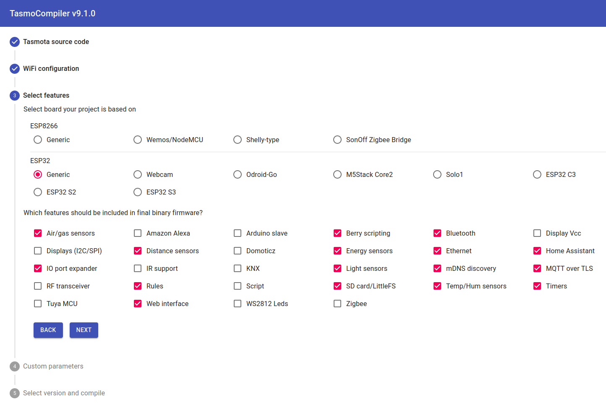
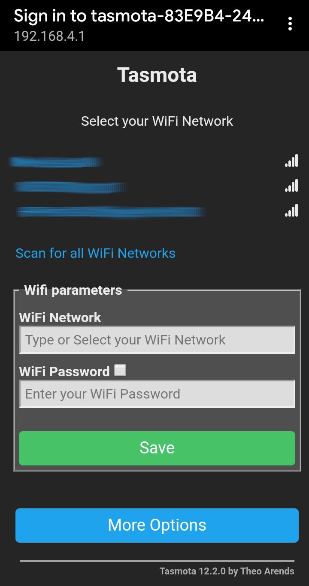
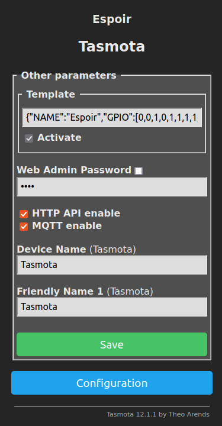

# Software

Espoir is compatible with _many_ software tools to accelerate development. This section outlines how to quickly get started with the most popular (and officially supported) ones.

## [ESP-IDF](https://docs.espressif.com/projects/esp-idf/en/stable/esp32/get-started/index.html)

ESP-IDF is Espressif's IoT Development Framework, the most barebones development framework for ESP32. It is the basic building block for all other frameworks, and features drivers for all peripherals. To get started, simply follow the [Getting Started guide](https://docs.espressif.com/projects/esp-idf/en/stable/esp32/get-started/index.html).

At the time of writing, most frameworks are based on ESP-IDF 4.4, and ESP-IDF 5.0 is currently in beta release.

## [Arduino-ESP32](https://docs.espressif.com/projects/arduino-esp32/en/latest/getting_started.html)

To program Espoir with Arduino, simply follow the [official Arduino-ESP32 documentation](https://docs.espressif.com/projects/arduino-esp32/en/latest/getting_started.html). Select `Connaxio's Espoir` as your board, either in ArduinoIDE or PlatformIO.

If you wish to quickly test Espoir, you can run the `ETH_LAN8720` example with the following modified line:

```cpp
ETH.begin(0, -1, 32, 33, ETH_PHY_KSZ8081, ETH_CLOCK_GPIO0_IN);
```

## [MicroPython](https://micropython.org/)

MicroPython for Espoir is currently supported by Connaxio ([source](https://github.com/Connaxio/micropython/tree/feature/espoir)).

You can download the compiled binary file here: [micropython-espoir-v1.19.1.bin](https://docs.connaxio.com/micropython/micropython-espoir-v1.19.1.bin).

Download and extract the latest esptool release from the [official repository on GitHub](https://github.com/espressif/esptool/releases) for the next steps.

If flashing for the first time, you should first erase Espoir's flash:

```bash
esptool.py --chip esp32 --port <PORT> erase_flash
```

then upload the binary file, by replacing `<PORT>` with the actual serial port, typically `/dev/ttyUSBx` for Linux and `COMx` for Windows:

```bash
esptool.py -p <PORT> -b 460800 --before default_reset --after hard_reset --chip esp32  write_flash --flash_mode dio --flash_size detect --flash_freq 80m 0x1000 micropython-espoir-v1.19.1.bin
```


You are now ready to open a serial port to Espoir with a baudrate of `115200`. After pressing `ENTER` once, you can type the following commands to establish your first LAN connection:

```python
from machine import Pin
import network

lan=network.LAN(mdc=Pin(32),mdio=Pin(33),power=None,phy_type=network.PHY_KSZ8081,phy_addr=0)

lan.active(1)
lan.ifconfig() # Prints DHCP configuration.
```

## [Tasmota](https://tasmota.github.io/docs/)

The preferred way to install Tasmota on Espoir is through [TasmoCompiler](https://github.com/benzino77/tasmocompiler) on [GitPod](https://gitpod.io/#https://github.com/benzino77/tasmocompiler).

The following guide outlines the main steps to get Espoir running with Tasmota 12.1.1. Refer to the [official documentation](https://tasmota.github.io/docs/) for help.

1. Go to [TasmoCompiler on GitPod](https://gitpod.io/#https://github.com/benzino77/tasmocompiler) to compile Tasmota for Espoir. 
   
    - (Optional) Enter your preferred WiFi network parameters. If you leave this empty, you will need configure WiFi after flashing.
   
    - Select `ESP32`:`Generic` and check `Ethernet` and other desired functionalities.
      
      
   
    - Enter the following `Custom parameters`:
      
      ```cpp
      #ifdef ETH_TYPE
      #undef ETH_TYPE
      #endif
      #define ETH_TYPE        6   // ETH_PHY_KSZ8081
      
      #ifdef ETH_ADDRESS
      #undef ETH_ADDRESS
      #endif
      #define ETH_ADDRESS     0   // Always 0 for Espoir
      
      #ifdef ETH_CLKMODE
      #undef ETH_CLKMODE
      #endif
      #define ETH_CLKMODE     0   // ETH_CLOCK_GPIO0_IN
      ```
   
    - After compilation is done, download one of the two `.BIN` files: 
      
       - `FIRMWARE.FACTORY.BIN` if this is the first time Tasmota is installed on the device.
       - `FIRMWARE.BIN` if this is an update.

2. Flash Tasmota to your device using esptool (download it from the [official repository on GitHub](https://github.com/espressif/esptool/releases) and extract the folder). Same as with MicroPython, you may want to first erase Espoir's memory:
	```bash
	esptool.py --port <PORT> erase_flash
	```
	Then flash Tasmota firmware:

   ```bash
	esptool.py --baud 921600 --port <PORT> write_flash --flash_size detect --flash_mode dio --flash_freq 80m 0x0 /path/to/tasmota32.factory.bin 
   ```
   
   Finally, reset the device with the reset button or unplug it.
   
   Refer to [Tasmota's official documentation](https://tasmota.github.io/docs/ESP32/#flashing) for more details.

3. If you left the WiFi information blank at Step 1, use your computer or smartphone to connect to the `tasmota-*` Wifi network that was created by your new device and configure the network parameters. 

	<center>

	
  
	</center>

4. Connect to your device's IP address in your web browser. This address is shown if you configured You can find this address in your router's user interface, or with tools such as `nmap` for Linux or `Advanced IP Scanner` for Windows.
   
    - If you did not previously enter any WiFi settings, you will need to connect to your device's temporary WiFi network to configure its connection to your home WiFi.

4. Configure Espoir's pins. In your device's new Tasmota Web Interface, go to `Configuration` -> `Configure Other`, and in the `Template` box, enter the following configuration line, activate it, and save:
   
   ```
   {"NAME":"Espoir","GPIO":[0,0,1,0,1,1,1,1,1,1,1,1,0,0,1,0,0,0,0,1,0,0,0,0,0,0,0,0,5568,5600,1,7968,1,1,1,1],"FLAG":0,"BASE":1}
   ```
   
   <center>

	
  
	</center>
   

5. (Optional) Deactivate WiFi to reduce power. Go back to the main menu, then go to `Consoles` -> `Console`, and type the command: `EthIpAddress`. You should see something similar to:
   
   ```
   RESULT = {"EthIPAddress":"0.0.0.0 (192.168.1.105)"}
   ```
   
   If both fields show `0.0.0.0`, you need to verify your Ethernet connection or configuration for problems. Otherwise, it is safe to disable WiFi with the command: `WiFi 0`. The web interface will now be available at the IP address displayed above.

**That's it**, you are now ready to configure your application-specific settings through the other menus of the web interface.
