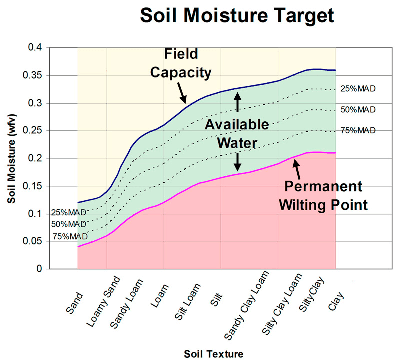
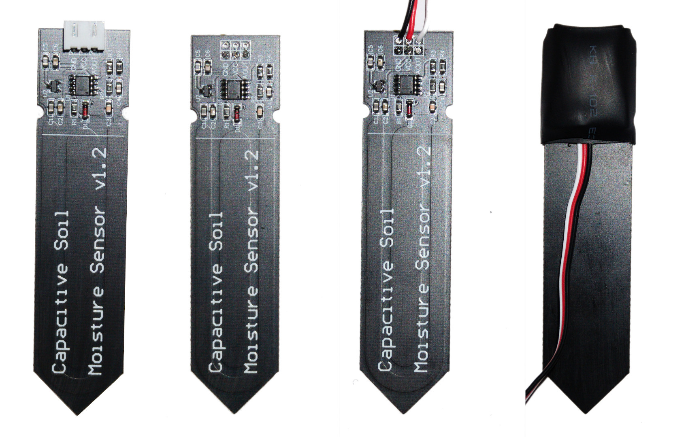
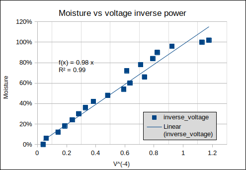
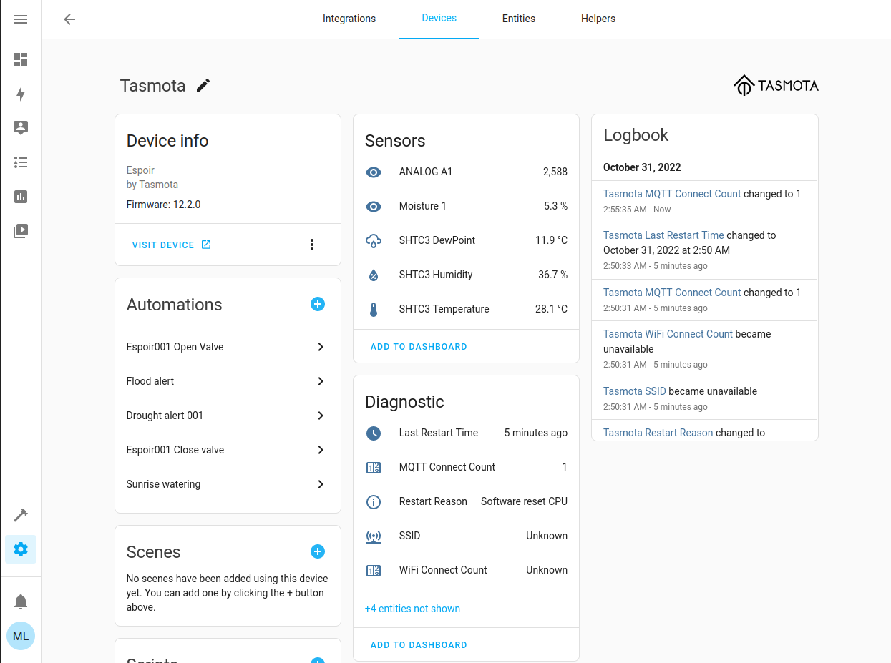
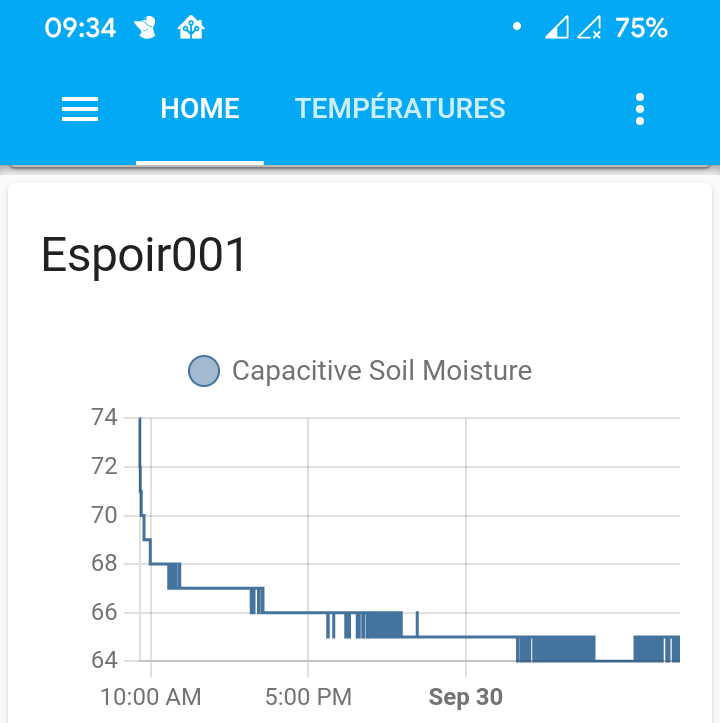

# IoT irrigation with Espoir

Following the [Espoir + Tasmota + Home Assistant](https://docs.connaxio.com/guides/tasmota_hass/) guide, one will want to start implementing real world automations. This guide covers smart irrigation with the cheap [Capacitive Soil Moisture Sensor v1.2](https://media.digikey.com/pdf/Data%20Sheets/DFRobot%20PDFs/SEN0193_Web.pdf), which can be found at many suppliers (Digi-Key, Mouser, Adafruit, Amazon, AliExpress, etc.) for less than $2. We will also be using Connaxio's [Servo-Valve](https://github.com/Connaxio/servo-valve), which uses off-the-shelf and 3D-printed parts to create an automated, low-power valve.

## Irrigation for dummies

*The following content is taken in good part from [soilsensor.com](https://soilsensor.com/soil/soil-moisture-and-irrigation/)*.

Plants need water periodically, but it gets a little more complicated than that, especially if you want to be water-efficient and make your plants as healthy as they can be.

The first concept to be introduced here is *field capacity*. Field capacity is the maximum amount of water a soil can hold, measured in volume percentage (% vol/vol). This value depends on the soil type. Sandy soils can hold much less water than clay soils, with silt in-between.

The second concept to be introduced is the *permanent wilting point*. That the lowest amount of water the soil can have before plants wilt and die. Humidity levels below that are *not good*. That is also a soil-dependent variable.

The third concept is maximum allowable depletion (MAD). MAD is the percentage of the zone between field capacity and permanent wilting point that a plant can use comfortably. This value is plant-dependant, and can change depending on growth stage.

The following graphic shows these concepts quite well:



You want to start watering when the soil moisture level reaches the plant's MAD level, and stop when the moisture level reaches the soil's field capacity. This way, the water variation remains at a positive stress level that keeps the plant hydrated while forcing it to develop strong, healthy roots.

## Using the capacitive soil moisture sensor

There are a few articles analyzing the performance of the moisture sensor and hinting on how to use it [[1]](https://static1.squarespace.com/static/59b037304c0dbfb092fbe894/t/5f03b711ea466f0eecac59cb/1594078996218/Capacitive_Soil_Moisture_Sensors.pdf)[[2]](https://www.researchgate.net/publication/311607215_APPLICATION_OF_SOIL_MOISTURE_SENSORS_IN_AGRICULTURE_A_REVIEW)[[3]](https://www.instructables.com/Capacitive-Soil-Moisture-Sensor-Basics/) (and others). The main points to consider when using the capacitive soil moisture sensor are the following:

1. **The sensor is not accurate.** Depending on how you insert it, the readings will change. It is, however, repeatable, as long as it is not moved.
2. **The sensor's response curve is non-linear.** That means, the relationship between the sensor's output voltage and the soil's moisture level can not be represented by a simple ratio, such as 0.1 V / \%.
3. **The sensor is not waterproof.** That's kind of dumb, but it is what it is. Fortunately, there are simple ways to fix that, which we will explore further.
4. **The default cable is very short.** That's not very useful, especially if you want to measure moisture at multiple locations. 

Note that you can also fix points 3 and 4 by buying a rugged, open source version of the sensor [on Tindie](https://www.tindie.com/products/miceuz/i2c-soil-moisture-sensor/). It will cost you an extra \$15, but will save you the trouble.

### Fixing the cable and waterproofing

First, we'll cut the connector off. Second, we'll solder a new cable in place. I like to use a 1 meter long servo (3 wires) cable. Finally, we'll use heatshrink to protect the sensor's electronics. 

For waterproofing, I prefer to position the cable so that it exits towards the pointy end of the sensor. A first piece of heatshrink, about twice as long as the electronics part, protects the electronics. It is then folder over and held in place by the second piece of heatshrink, which is shorter.



Two waterproofing alternatives also exist:

1. Use a 3-core cable and smaller heatshrink similarly to what [white box labs](https://www.whiteboxes.ch/shop/i2c-soil-moisture-sensor/) does.

2. Cover the electronics in epoxy, cyanoacrylate (krazy glue), or polyurethane varnish. However, these options **will** modify the sensor's response curve, so you'll need to figure out a new calibration equation (which may or may not be complicated).

### Calibrating the sensor

<center>



</center>

**Moisture = 100\% * ( ( voltage(100\%) / voltage ) ^ 4 )**

No joke, it's as simple as it gets. This formula gives the soil's moisture value with a 10\% margin in a silt soil sample, which is not fabulous, but still quite good for the price, and good enough for our application. Anyway, we did mention the sensor was inaccurate but repeatable, and we'll compensate for that inaccuracy once we are in the field with a second field calibration.

To get the sensor value at 100\% moisture, simply fully submerge the sensing part **below the line** (not the whole sensor!) in a glass of water, and write down the voltage or ADC value.

Note: if you use a different soil moisture sensor model, the calibration curve may change. You can get a rough estimate of a new, proper exponent for the curve by measuring the sensor output when submerging exactly 50\% of the sensing part into water, then inserting that value in the formula above. Change the exponent until the formula outputs 50\%. Again, we're following the "good enough" route, since we don't necessarily want to invest a lot of money into an expensive sensor.

## Connecting the sensor to Espoir and Home Assistant

### Configuring the input pin

If you're not familiar with Tasmota or Home Assistant yet, first [follow our guide](https://docs.connaxio.com/guides/tasmota_hass/) to setup Tasmota on Espoir. Then go to `Configuration` -> `Configure module` to set one of the IO pins to `ADC Input`, like so:

<center>


</center>

Here, we chose ADC **1**. This is important for the next steps.

### Creating the calibration curve script

Next, we'll create a Berry script that transforms our raw sensor readings to a moisture value and sends them over MQTT to Home Assistant. From Tasmota's main menu, go to `Consoles` -> `Manage File system` and create a file named `moisture.be`. Add the following code to it:

```py
import string
import math
import mqtt

def rule_moisture_sensor(value, trigger)
  # Get the ADC number if we have many sensors
  var i=string.find(trigger,"#A")
  var tr=string.split(trigger,i+2)
  var adc=number(tr[1])

  # '1240' is our "voltage(100%)" value for a 12 bits ADC reading 1 volt
  var moist = 100.0 * math.pow(1240.0 / value, 4.0)

  # Format moisture for MQTT
  var topic = string.format("tele/Espoir001/SENSOR/MOISTURE_%i", adc)
  var payload = string.format("%0.1f", moist);
  mqtt.publish(topic, payload)
end

tasmota.add_rule("ANALOG#A1", rule_moisture_sensor)
```

We used our ADC number on that last line to match the pin to the new rule.

Then, create or edit a file called `autoexec.be`, and add the following line to it:

```py
load("moisture")
```

Now, every time a new value will be read from our moisture sensor, the corresponding moisture level will be sent over MQTT.

### Enabling discovery in Home Assistant

Finally we'll create a rule that allows Home Assistant to detect our new sensor. From Tasmota's main menu, go to `Consoles` -> `Console`, and paste the following code, which creates a rule where on each reboot, our new sensor will be discovered by Home Assistant:

```
rule2 on system#boot do publish2 homeassistant/sensor/%macaddr%/tasmota_moisture_1/config {
  "name": "Tasmota Moisture 1",
  "state_topic": "tele/%topic%/SENSOR/MOISTURE_1",
  "unique_id": "%macaddr%_tasmota_moisture_1",
  "value_template": "{{value_json}}",
  "unit_of_measurement": "%%",
  "device": {
    "connections": [
      [
        "mac",
        "%macaddr%"
      ]
    ]
  }
} endon
```

Then enable the rule:

```
rule2 1
```

And restart the device to apply the change.

```
restart 1
```

You should now see a new value "Moisture 1" appear under your Tasmota device in Home Assistant.



## Prepare the valve

 If you chose to use Connaxio's [servo-valve](https://github.com/Connaxio/servo-valve), you may now set one of Espoir's pins to `PWM` (the PWM number should be **6 or above**) similarly to what we did for our ADC pin. Next, create a new file named `autoexec.bat`, and write to it:

```
PwmFrequency 40
```

Which will set the PWM module to output a frequency that can be used by servo motors. Restart the device when you are done editing the file.

Next, you must go to Tasmota's console and find the PWM values that open and close the valve. Simply write:

```
Pwm# XX
```

Where `#` is the PWM number you chose and `XX` is the PWM value, which is typically comprised between 20 and 100, but may be out of this range.

Once you've found the open and close values, go to Home Assistant -> `Settings` -> `Automations & Scenes` and create new rules to open and close the valve, similarly to how we did it in [Espoir + Tasmota + Home Assistant](http://localhost:8080/guides/tasmota_hass/). The `Actions` should ressemble this:


## Water the plants

Now, remember when we talked about the Field Capacity, Permanent wilting point and Maximum Allowable Depletion levels? These will set your triggers to open and close the valve, possibly with a condition to only water between sunrise and sunset. Our irrigation rules will be similar to:

- Open the valve when **moisture = field capacity - MAD**
- Close the valve when **moisture = field capacity**

And how do we determine field capacity? Simply insert the sensor into the soil / plant pot you want to irrigate and *drench* the soil around it, preferably in the evening to reduce evaporation. We suggest putting a bowl or pot on top of the sensor to avoid moving accidently, because the calibration will probably need to be redone after that (remember when we said they aren't accurate, but they are repeatable?).

In the morning, look at the moisture value that is sent by the sensor. That will be your field capacity value. You should be able to observe a moisture curve similar to this one over the night:

<center>



</center>

We can see that the excess water is drained by gravity overnight, the soil moisture stabilizing around 64\% (in pure clay soil). Is this an accurate value? No, in fact it is pretty far off from our initial calibration curve, which may be due to the difference in the nature of the soil, or water-soaked wood chips around the sensor's head. It is, however, a *repeatable* measurement, meaning that whenever we have the same amount of water in the soil, the sensor will read the same value, as long as it is not moved.

In a pure clay soil, with cucumbers that have a MAD of 20\%, the level at which we would want to open our valve for watering is **36\% - 20\% * (36\% - 21\%) = 33\%**. Since our actual reading of the field capacity is 64\%, we'll scale this number up to match our measurement. **33\% * 64\% / 36\% = 59\%**.

And we now have a smart irrigation system that optimizes water usage to give us healthy plants, fresh vegetables, and small water bills.
