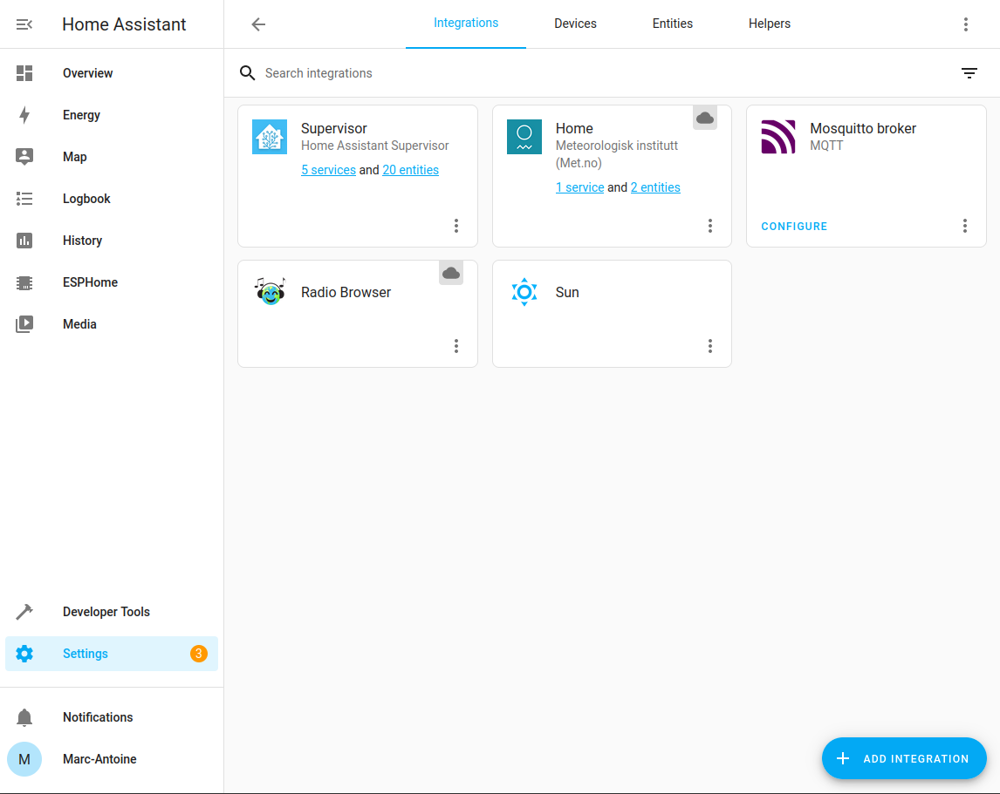

# Getting started with Tasmota and Home Assistant

This tutorial shows how to install Tasmota firmware on Espoir, then connect Espoir to a Home Assistant installation via MQTT.

This setup is adequate for **local, private networks** on a dedicated computer or mini-PC such as the Raspberry Pi. Setting up Home Assistant on a non-local device (such as a rented Virtual Private Server) is **much more** involved and requires extensive knowledge about docker containers and network security, and will not be covered here.

**1. Install Tasmota**

Follow the [instructions](https://docs.connaxio.com/espoir/software.html#tasmota) to create, download, install, and perform the initial configuration of Tasmota on Espoir.

**2. Setup Home Assistant**

If you don't already have one, [create a Home Assistant installation](https://www.home-assistant.io/installation/) on the computer or mini-PC of your choice. The preferred method is to use the `Home Assistant Operating System`, as it keeps itself updated and enables add-ons for easy configuration.
    
**3. Add a MQTT broker**

After you connected to your installation in your web browser (either with the URL shown by your installation ("homeassistant.local:8123") or the computer's IP address ("192.168.1.xxx:8123")) and [went through the initial configuration steps](https://www.home-assistant.io/getting-started/onboarding) of Home Assistant, the next step is to add a MQTT broker, which is the server that relays messages between Home Assistant and your devices. Go to `Settings` (small gear symbol at the bottom left of the interface), then `Add-ons`. Click the `ADD-ON STORE` button at the bottom right, type `mosquitto` in the search bar and install the `Mosquitto broker` add-on. Finally, start the Add-on.


**5. Add the MQTT client to Home Assistant**

In your Home Assistant installation, go to `Settings` -> `Devices & Services`. If you chose the OS installation, you should be offered to complete the installation of the MQTT integration, which will be done automatically. 

Else, click `ADD INTEGRATION` in the bottom right corner. Search for `mqtt` and install the MQTT client integration.



**6. Configure Espoir and Tasmota to connect to the broker**

Go back to you Espoir / Tasmota Device, and navigate to `Configuration` -> `Configure MQTT`. Enter the host name or IP, leave the port to the default `1883`, and change the `Client` and `Topic` names. I like to keep them the same. The `User` and `Password` fields are the same as your Home Assistant user.


<center>


</center>

Click Save, and after the reboot, go to `Consoles` -> `Console`. Look for the following line:

```
01.23.45.678 MQT: Connected
```

If you see this line, congratulations! You device is connected. Otherwise, if you see:

```
01.23.45.678 MQT: Connect failed to 192.168.122.107:1883, rc 5. Retry in 10 sec
```

This means one of the parameters of your Tasmota MQTT configuration is wrong. Check your parameters. user/password, network cable, host / port (make sure it does not include "http://")

