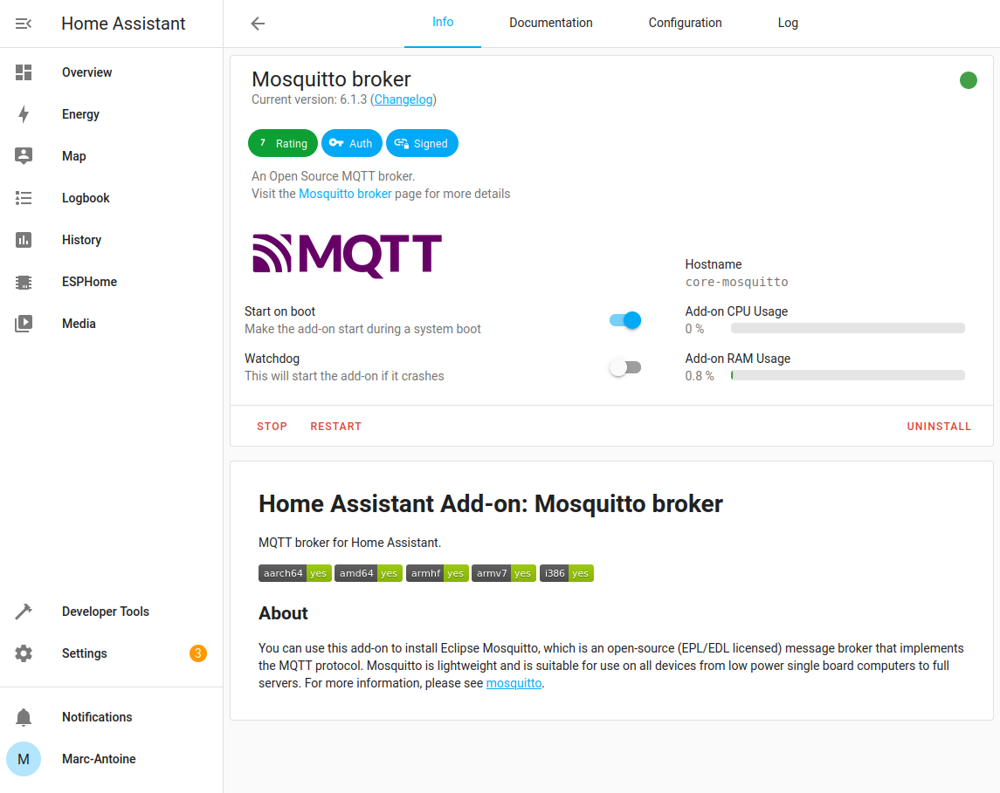
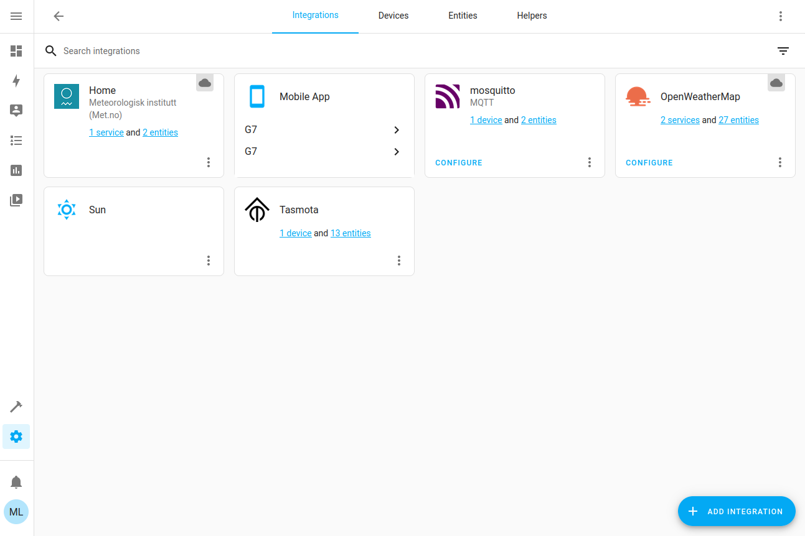
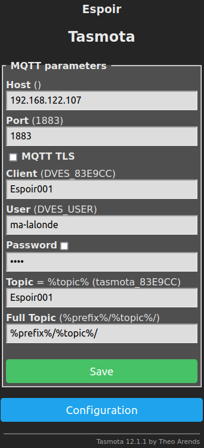
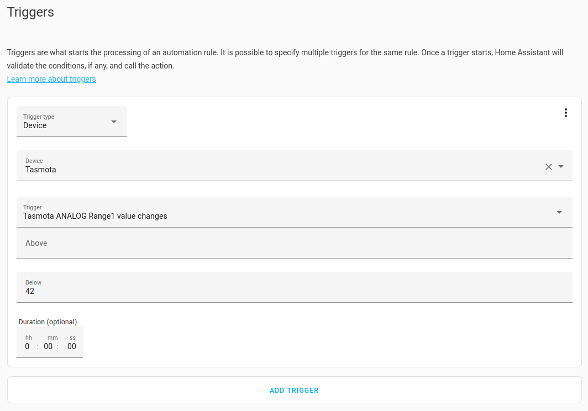
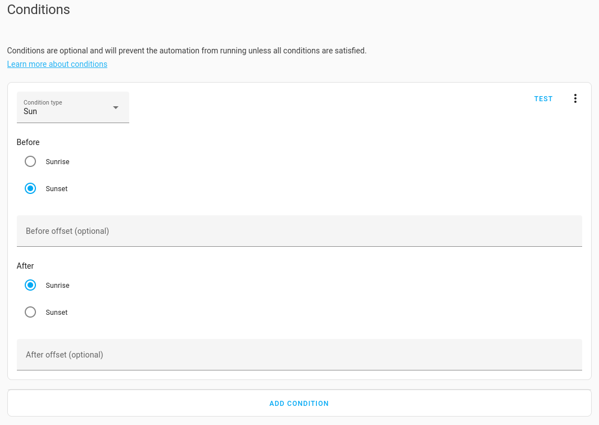
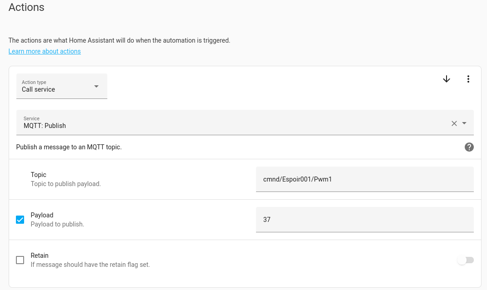
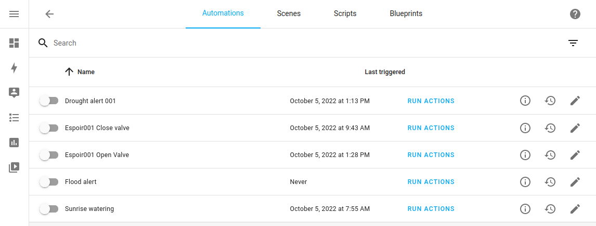
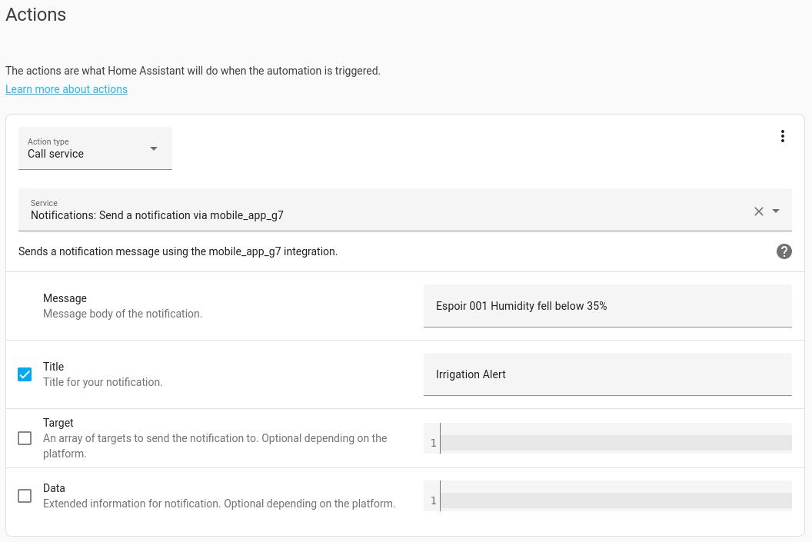

# Getting started with Tasmota and Home Assistant

This tutorial shows how to install [Tasmota](https://tasmota.github.io/docs/) firmware on Espoir, then connect Espoir to a [Home Assistant](https://www.home-assistant.io/) IoT dashboard installation via MQTT.

This setup is adequate for **local, private networks** on a dedicated computer or mini-PC such as the Raspberry Pi. Setting up Home Assistant on a non-local device (such as a rented Virtual Private Server) is **much more** involved and requires extensive knowledge about docker containers and network security, and will not be covered here.

**1. Setup Home Assistant**

If you don't already have one, [create a Home Assistant installation](https://www.home-assistant.io/installation/) on the computer or mini-PC of your choice. The preferred method is to use the `Home Assistant Operating System`, as it keeps itself updated and enables add-ons for easy configuration.

**2. Add a MQTT broker**

After you connected to your installation in your web browser (either with the URL shown by your installation ("homeassistant.local:8123") or the computer's IP address ("192.168.1.xxx:8123")) and [went through the initial configuration steps](https://www.home-assistant.io/getting-started/onboarding) of Home Assistant, the next step is to add a MQTT broker, which is the server that relays messages between Home Assistant and your devices. Go to `Settings` (small gear symbol at the bottom left of the interface), then `Add-ons`. Click the `ADD-ON STORE` button at the bottom right, type `mosquitto` in the search bar and install the `Mosquitto broker` add-on. Finally, start the Add-on.



**3. Add the MQTT and Tasmota integrations to Home Assistant**

In your Home Assistant installation, go to `Settings` -> `Devices & Services`. If you chose the OS installation, you should be offered to complete the installation of the MQTT integration, which will be done automatically. 

Else, click `ADD INTEGRATION` in the bottom right corner. Search for `mqtt` and install the MQTT integration. Do the same thing with `Tasmota`.



**4. Install Tasmota on Espoir**

Follow the [instructions](https://docs.connaxio.com/espoir/software.html#tasmota) to create, download, install, and perform the initial configuration of Tasmota on Espoir.

**5. Configure Espoir and Tasmota to connect to the broker**
Follow the [official guide](https://tasmota.github.io/docs/MQTT/#configure-mqtt-using-webui), or continue below:

Go back to you Espoir / Tasmota Device, and navigate to `Configuration` -> `Configure MQTT`. Enter the host name or IP, leave the port to the default `1883`, and change the `Client` and `Topic` names. I like to keep them the same. The `User` and `Password` fields are the same as your Home Assistant user.

<center>



</center>

Click Save, and after the reboot, go to `Consoles` -> `Console`. Look for the following line:

```
01.23.45.678 MQT: Connected
```

If you see this line, congratulations! You device is connected. Otherwise, if you see:

```
01.23.45.678 MQT: Connect failed to 192.168.122.107:1883, rc 5. Retry in 10 sec
```

This means one of the parameters of your Tasmota MQTT configuration is wrong. Check your parameters. user/password, network cable, host / port (make sure it does not include "http://").

You can find more information on connecting Tasmota with Home Assistant on [Tasmota's dedicated page](https://tasmota.github.io/docs/Home-Assistant/#tasmota-integration)

**7. Create an automation**

Well now, things can talk to each other, that's great. If you wish to, you can play around with the Tasmota configuration to change sensors' refresh interval, create startup scripts, setup pins for various sensors, or [prepare Tasmota for servo-motor-compatible PWM](https://tasmota.github.io/docs/Peripherals/#pwm). 

Finally, we can create our first automation!

Tasmota has an extensive set of available [commands](https://tasmota.github.io/docs/Commands/) which we can use to create all sorts of automations. What we'll do here is send these commands via MQTT from Home Assistant to our Espoir / Tasmota device to activate a peripheral. In this example, I have a servo motor that opens and closes a valve to water plants as needed, determined by a soil moisture sensor.

In Home Assistant, go to `Settings` -> `Automation and Scenes`, then click on `CREATE AUTOMATION` in the bottom right corner. For this example, we'll start with an empty automation.

First, the **Triggers**. I want to open the valve every time the soil becomes too dry, which is indicated by an analog signal from Espoir.



Second, set the **Conditions** which limit when this trigger is valid. In this case, I only want to water the plants between sunrise and sunset.



Finally, set the **Actions** that take place when the soil is dry. In this case, send a PWM signal to Espoir to set the servo motor and the valve in the "open" position.



(Note: "37" in this case is the 10-bit PWM value, meaning `Duty(μs) = 37 / 1023 * 1,000,000 μs/s / 40 Hz = 904 μs`.)

This command will tell Tasmota to set the `Pwm1` signal to 904 μs, which will open the valve.

After this first rule, one can create as many as they want to really fine-tune their water supply.



You can even create alerts for your **Home Assistant smartphone App** to get notified of any event!



## Final thoughts

Obviously, a **lot** of stuff was not covered in this tutorial. Unfortunately, it is not possible to cover every functionality offered by projects like Tasmota and Home Assistant. It would also be pointless, since they already create their own very extensive documentation.

Creating a custom IoT application can be very simple, but this setup can also become a lot more complex. You could run the Home Assistant Container installation on a Virtual Private Server with a reverse proxy, so that you can connect your devices to "mqtt.website.com" and log in to "hass.website.com". That would allow you to run an automation setup from anywhere, on a public or work network, or on-the-go for demonstrations. That involves setting up redirection for a few URLs, SSL encryption certificates, and running docker compose on top of what we've seen above. Sky's the limit!
