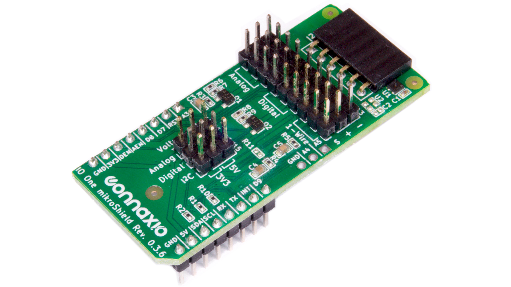
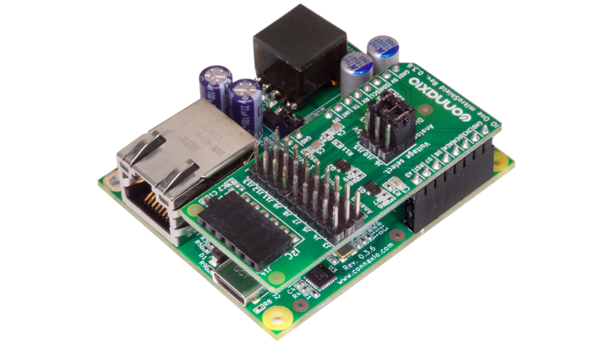
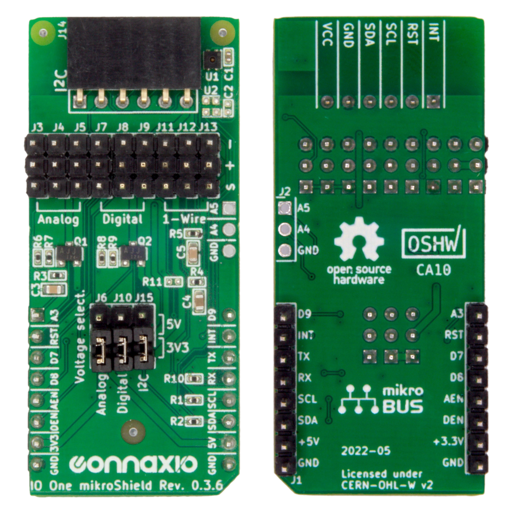
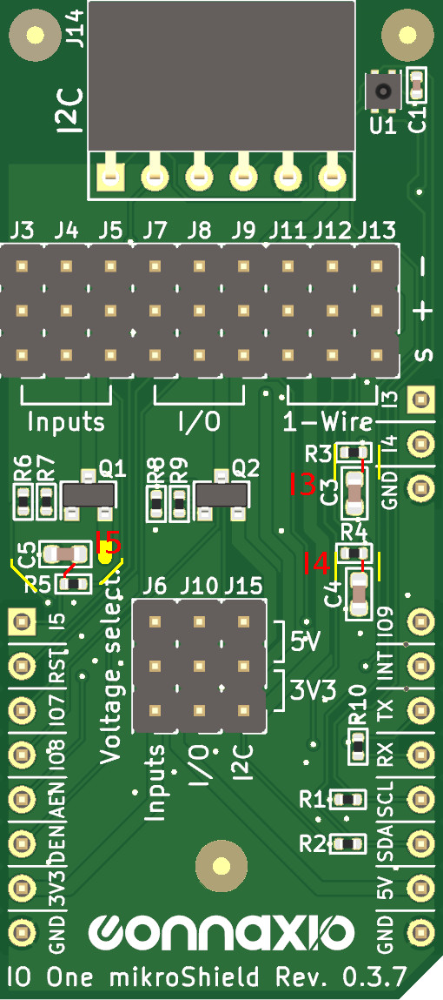

# IO One mikroShield

## Overview

The IO One mikroShield is a mikroBUSTM add-on board that provides nine signal-voltage-ground (SVG) connectors, a temperature & humidity sensor, as well as a PmodTM Compatible I2C connector.

#### Example applications

- Smart watering with a [Capacitive Soil Moisture Sensor](https://www.aliexpress.com/wholesale?catId=0&initiative_id=SB_20220617093542&SearchText=capacitive+soil+moisture+sensor)
- Valve control
- Servo control
- 5 V pumps and motors control
- Temperature monitoring with the [SHTC3](https://sensirion.com/media/documents/643F9C8E/6164081E/Sensirion_Humidity_Sensors_SHTC3_Datasheet.pdf) or a [DS18B20](https://datasheets.maximintegrated.com/en/ds/DS18B20.pdf) temperature sensor
- Humidity monitoring with the [SHTC3](https://sensirion.com/media/documents/643F9C8E/6164081E/Sensirion_Humidity_Sensors_SHTC3_Datasheet.pdf)
- A/C hacking for walk-in coolers

**Figure: The IO One mikroShield assembled on [Espoir](https://docs.connaxio.com/espoir/hardware.html)**

## Features & Specifications

- 9x Signal-Voltage-Ground (SVG) connectors
   - 3x input-only signals
      - Analog or digital inputs
      - Voltage pins 3.3 V or 5 V selection via jumper for the whole group
      - Voltage pins PMOS on/off switch for the whole group
      - 16 Hz RC low-pass filter for each signal that can be removed by removing the corresponding capacitor connection
      - 2 signals require the extension I/Os to work, but can otherwise be used for on/off control through the Voltage pin
   - 3x input-output signals
      - Analog or digital inputs
      - Digital outputs
      - Voltage pins 3.3 V or 5 V selection via jumper for the whole group
      - Voltage pins PMOS on/off switch for the whole group
   - 3x 1-wire signals
      - Fixed 3.3 V on the Voltage pin
      - Single 1-wire bus for the three connectors
      - Controllable via UART or bit-banging
- [SHTC3](https://sensirion.com/media/documents/643F9C8E/6164081E/Sensirion_Humidity_Sensors_SHTC3_Datasheet.pdf) I2C Temperature & Humidity Sensor
   - 0.2 oC temperature accuracy
   - 2 % humidity accuracy
- Digilent PmodTM Compatible I2C connector
   - Complies with the Digilent PmodTM Interface Specification version 1.3.1
   - Includes the optional `INT` and `RESET` signals
   - Voltage pins 3.3 V or 5 V selection via jumper
   - Works with most I2C devices, not just PmodTM Compatible modules

## Dimensions, and Top & Bottom Views

- Note: `Analog` and `Digital` markings have been replaced with `Inputs` and `IOs` in the current version.

- The IO One mikroShield conforms to the "L" size of the [mikroBUSTM add-on boards standard](https://download.mikroe.com/documents/standards/mikrobus/mikrobus-add-on%20boards-standard.pdf).

- All through-hole pins are aligned with the same 100-mils (2.54 mm) grid with a 50 mils (1.27 mm) offset from the bottom-left corner, making the IO One mikroShield protoboard- and breadboard-friendly.

- For the SVG connectors, the mikroBUSTM numbers correspond to the SVG conenctor number. For example, `A3` corresponds to `J3`, and `D9` corresponds to `J9`.

## Pinout

**Table 1: Pinout**

| IO One mikroShield        | mikroBUSTM add-on | mikroBUSTM socket | [Espoir](https://docs.connaxio.com/espoir/hardware.html)'s ESP32-MINI-1 |
|:------------------------- |:---------------------------- |:---------------------------- |:----------------------------------------------------------------------- |
| I5                        | AN                           | AN                           | I36                                                                     |
| PmodTM RST / 2 | RST                          | RST                          | IO5                                                                     |
| IO7                       | CS                           | CS                           | IO15                                                                    |
| IO8                       | SCK                          | MOSI / SDO                   | IO14                                                                    |
| ENI                       | SDO                          | MISO / SDI                   | IO12                                                                    |
| ENIO                      | SDI                          | SCK                          | IO13                                                                    |
| IO9                       | PWM                          | PWM                          | IO2                                                                     |
| PmodTM INT / 1 | INT                          | INT                          | IO4                                                                     |
| TX                        | TX                           | RX                           | IO9                                                                     |
| RX                        | RX                           | TX                           | IO10                                                                    |
| PmodTM SCL / 3 | SCL                          | SCL                          | IO18                                                                    |
| PmodTM SDA / 4 | SDA                          | SDA                          | IO23                                                                    |
| I4                        | -                            | -                            | I37                                                                     |
| I3                        | -                            | -                            | I38                                                                     |

## Removing the `Inputs`' RC Low-Pass Filter

There are two options to remove the RC filters on the input-only signals.

- Unsolder the corresponding capacitor (**preferred method**)
- **> Do at your own risks <** Cut the desired **red** traces as shown below. Cut **across** the trace in red and be careful not to damage the traces around it (yellow). In case of doubt, use a multimeter to check if there is contact between the two ends of the trace or between the trace and the surrounding ground plane.

*(Zoom-in on the picture to see the details)*

## Additional Resources

- [IO One mikroShield's source on GitHub](https://github.com/Connaxio/io-one-mikroshield)
- [IO One mikroShield's OSHWA certification](https://certification.oshwa.org/ca000010.html)
- [PmodTM reference and modules](https://digilent.com/reference/pmod/start)
- [Digilent PmodTM Interface Specification](https://digilent.com/reference/_media/reference/pmod/pmod-interface-specification-1_3_1.pdf)
