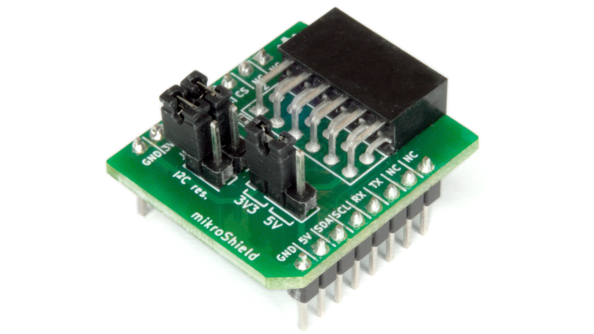
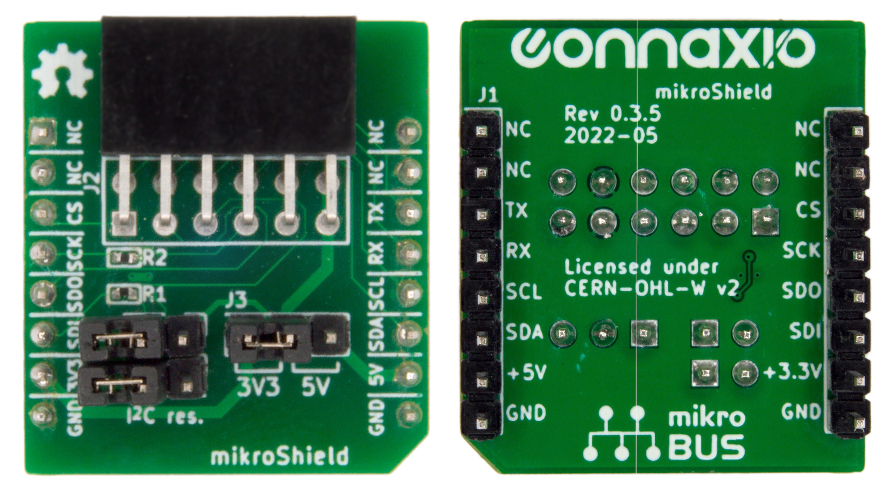

# PmodTM Compatible mikroShield

## Overview
The PmodTM Compatible mikroShield is a simple mikroBUSTM add-on board that links the Digilent PmodTM Interface Specification to the mikroBUSTM standard. 

The PmodTM Compatible mikroShield is fully passive and allows for connecting 6-pins and 12-pins PmodTM Compatible modules, as well as various wired sensors and breakout boards.

The Digilent PmodTM Compatible connector's supply voltage can be switched between 3.3 V and 5 V using the header, and the I2C pull-up resistors can be disconnected as necessary.

## Dimensions and Top & Bottom Views

The PmodTM Compatible mikroShield conforms to the "S" size of the [mikroBUSTM add-on boards standard](https://download.mikroe.com/documents/standards/mikrobus/mikrobus-add-on%20boards-standard.pdf).

## Pinout

**Table: Pinout**
| PmodTM pin #   | mikroBUSTM add-on  | mikroBUSTM socket  | [Espoir](https://docs.connaxio.com/espoir/hardware.html)'s ESP32-MINI-1 |
|:--------------------------|:------------------------------|:------------------------------|:----------------------|
| 1                         | CS                            | CS                            | IO15                  |
| 2                         | SDI                           | MOSI / SDO                    | IO13                  |
| 3                         | SDO                           | MISO / SDI                    | IO12                  |
| 4                         | SCK                           | SCK                           | IO14                  |
| 7                         | TX                            | RX                            | IO9                   |
| 8                         | RX                            | TX                            | IO10                  |
| 9                         | SCL                           | SCL                           | IO18                  |
| 10                        | SDA                           | SDA                           | IO23                  |

**Table: Pinout (continued)**
| PmodTM pin #   | PmodTM SPI | PmodTM I2C  | PmodTM UART    |
|:--------------------------|:----------------------|:------------------------------|:------------------------------|
| 1                         | CS                    | INT                           | CTS                           |
| 2                         | MOSI                  | RESET                         | TXD                           |
| 3                         | MISO                  | SCL                           | RXD                           |
| 4                         | SCK                   | SDA                           | RTS                           |
| 7                         | IO7                   | IO7                           | IO7                           |
| 8                         | IO8                   | IO8                           | IO8                           |
| 9                         | IO9                   | IO9                           | IO9                           |
| 10                        | IO10                  | IO10                          | IO10                          |

For more details, refer to the [Digilent PmodTM Interface Specification](https://digilent.com/reference/_media/reference/pmod/pmod-interface-specification-1_3_1.pdf).

## Additional Resources
- [PmodTM Compatible mikroShield's source on GitHub](https://github.com/Connaxio/pmod-compatible-mikroshield)
- [PmodTM reference and modules](https://digilent.com/reference/pmod/start)
